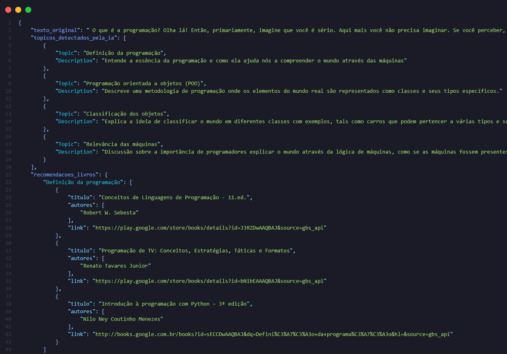

# TagBook 

TagBook é um sistema inteligente de recomendação de livros baseado em Inteligência Artificial.

O projeto acadêmico recebe um arquivo de áudio contendo aulas, palestras ou conteúdos educacionais, realiza a transcrição automática do áudio, 
identifica os principais tópicos abordados utilizando IA local e recomenda livros relacionados aos assuntos detectados.

---

# Funcionalidades

- Processamento de áudio e transcrição automática utilizando Whisper
- Extração de tópicos utilizando IA local com LM Studio
- Integração com o modelo Phi-3 Mini
- Busca automática de livros com Google Books API
- Geração de relatório estruturado em JSON
- Análise de tópicos executada localmente através do LM Studio

---

# Como o Sistema Funciona

```text
Áudio (.opus)
      ↓
Whisper
(Transcrição)
      ↓
Texto Transcrito
      ↓
LM Studio + Phi-3 Mini
(Extração de Tópicos)
      ↓
Google Books API
(Busca de Livros)
      ↓
Relatório JSON
(Recomendações)
```

---

# Tecnologias Utilizadas

- Python
- Whisper
- LM Studio
- Phi-3 Mini
- OpenAI SDK
- Google Books API
- Requests
- JSON

---

# Instalação

## 1. Clone o repositório

```bash
git clone https://github.com/1arthurncc/RecomendadorTagBook.git
cd RecomendadorTagBook
```

---

## 2. Instale as dependências

```bash
pip install -r requirements.txt
```

---

# Pré-requisitos

## Python

- Python 3.10 ou superior

---

## FFmpeg

O Whisper necessita do FFmpeg instalado e configurado no PATH.

### Windows

Baixe:
https://ffmpeg.org/download.html

Após instalar, adicione o FFmpeg ao PATH do sistema.

### Linux

```bash
sudo apt install ffmpeg
```

### macOS

```bash
brew install ffmpeg
```

---

# Instalação do LM Studio

## Windows

1. Baixe o instalador:
https://lmstudio.ai

2. Execute o instalador

3. Abra o LM Studio

4. Vá em:

```text
Developer → Status
```

5. Ative o servidor local

6. Habilite:

```text
Enable CORS
```

---

## macOS

1. Baixe o arquivo `.dmg`
2. Arraste para `/Applications`
3. Abra o aplicativo

---

# Download do Modelo

Dentro do LM Studio:

```text
Discover → Model Search
```

Pesquise por:

```text
phi-3-mini-4k-instruct
```

Clique em **Download**.

Após baixar, carregue o modelo no servidor local.

---

# Executando o Projeto

Coloque o áudio desejado na pasta:

```text
Audios/
```

Configure o caminho no código:

```python
CAMINHO_AUDIO = "Audios/programacao.opus"
```

Execute:

```bash
python Recomendador.py
```

---

# Exemplo de Saída

O sistema gera um arquivo JSON contendo:

- texto transcrito
- tópicos detectados
- recomendações de livros

Exemplo:

```



```

---

# Estrutura do Projeto

```text
RecomendadorTagBook/
│
├── Audios/
├── img/
├── relatorios/
├── Recomendador.py
├── requirements.txt
├── README.md
└── .gitignore
```

---

# Objetivo do Projeto

O objetivo do TagBook é automatizar a descoberta de materiais complementares de estudo através de:

- processamento de áudio
- inteligência artificial
- NLP (Processamento de Linguagem Natural)
- sistemas de recomendação

O projeto foi desenvolvido como estudo prático de integração entre IA local, APIs e automação educacional.

---

# Autor

Arthur Nichele

Estudante de Tecnologias da Informação e Comunicação — UFSC